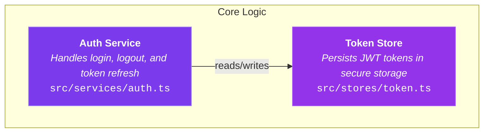

# Walkthrough Skill

A skill that generates Mermaid diagram files (`.mmd`) — flowcharts and ER diagrams — to explain codebase features, flows, architecture, and database schemas.

Inspired by [Amp's Shareable Walkthroughs](https://ampcode.com/news/walkthrough).

## What it does

Ask your agent to walk you through any part of your codebase and it produces a self-contained `.mmd` file with:

- A **Mermaid diagram** (flowchart or ER diagram) showing the key concepts and their connections
- **Rich node labels** with title, description, and file paths embedded directly in each node
- **Subgraph groupings** for logical organization
- **Color-coded node types** (components, utilities, events, data, etc.)

The goal is fast onboarding: give a new developer a mental model of how something works in under 2 minutes. Not a code reference — a map.

The `.mmd` output renders natively on **GitHub**, in **VS Code** (with Mermaid extensions), in the [**Mermaid Live Editor**](https://mermaid.live), and in many other tools.

## Usage

Trigger the skill with prompts like:

```
walkthrough how does authentication work
explain this flow
walk me through the checkout process
how does X work
database schema
explain the tables
```

The agent will:
1. Explore the relevant parts of your codebase using parallel subagents
2. Synthesize findings into 5-12 key concepts and their connections
3. Generate a single `walkthrough-{topic}.mmd` file in the project root

## Examples

**Feature flow:**
> Use the walkthrough skill and explain the process of what happens when a user submits a form.

**Architecture overview:**
> Walk me through how the plugin system is organized.

**Database schema (ER diagram):**
> Use the walkthrough skill and explain how the invites entity is stored in the database. Use an ER diagram.

**Data flow:**
> How does state flow from the composable to the component?

## Installation

### Quick install

```bash
npx skills add https://github.com/alexanderop/walkthrough --skill walkthrough
```

### Manual install

Copy the `skills/walkthrough/` directory into your project's `.claude/skills/` folder:

```
your-project/
  .claude/
    skills/
      walkthrough/
        skill.md
```

## Structure

```
skills/walkthrough/
  skill.md              # Main skill definition
```

- **skill.md** — The skill prompt that the agent follows. Defines the workflow: scope understanding, parallel codebase exploration, diagram type selection, and Mermaid file generation.

## Output format

The generated `.mmd` files are self-contained Mermaid diagrams. Each node embeds its title, description, and file paths directly in the label:



No build step, no CDN dependencies. Just a `.mmd` file that renders anywhere Mermaid is supported.
