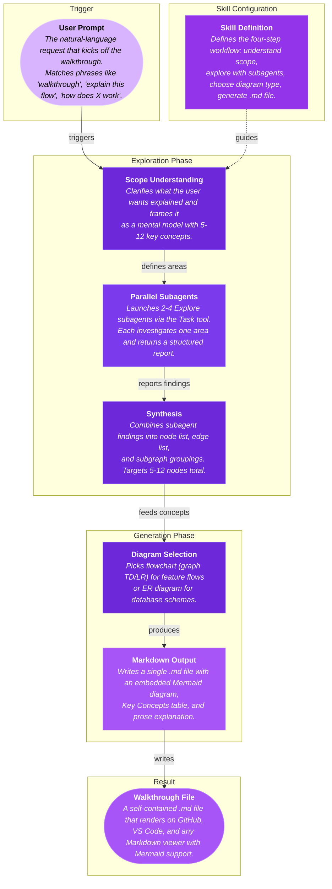

# Walkthrough: How the Walkthrough Skill Works

> The walkthrough skill turns a plain-English prompt into a Markdown document with an embedded Mermaid diagram of your codebase. The AI agent reads the skill definition, launches parallel subagents to explore relevant code, synthesizes findings, and outputs a self-contained `.md` file with a diagram, reference table, and prose explanation.

## Diagram

## Key Concepts

| Concept | Description | File(s) |
|---------|-------------|---------|
| **User Prompt** | The natural-language request that kicks off the walkthrough. Matches phrases like "walkthrough", "explain this flow", "how does X work". | `skills/walkthrough/skill.md:1-3` |
| **Skill Definition** | Defines the four-step workflow: understand scope, explore with subagents, choose diagram type, generate .md file. | `skills/walkthrough/skill.md` |
| **Scope Understanding** | Clarifies what the user wants explained and frames it as a mental model with 5-12 key concepts. | `skills/walkthrough/skill.md:25-35` |
| **Parallel Subagents** | Launches 2-4 Explore subagents via the Task tool. Each investigates one area and returns a structured report. | `skills/walkthrough/skill.md:37-88` |
| **Synthesis** | Combines subagent findings into node list, edge list, and subgraph groupings. Targets 5-12 nodes total. | `skills/walkthrough/skill.md:90-100` |
| **Diagram Selection** | Picks flowchart (graph TD/LR) for feature flows or ER diagram for database schemas. | `skills/walkthrough/skill.md:102-170` |
| **Markdown Output** | Writes a single .md file with an embedded Mermaid diagram, Key Concepts table, and prose explanation. | `skills/walkthrough/skill.md:172-240` |
| **Walkthrough File** | A self-contained .md file that renders on GitHub, VS Code, and any Markdown viewer with Mermaid support. | `walkthrough-*.md` |

## How It Connects

The process starts when a user writes a natural-language prompt asking to understand part of a codebase. The skill definition guides the agent through a four-step workflow. First, the agent clarifies the scope and frames the request as a mental model with 5-12 key concepts. Then it launches parallel Explore subagents to investigate different areas of the codebase, and synthesizes their findings into a structured list of nodes, edges, and groupings. Finally, the agent selects the appropriate diagram type and generates a Markdown file containing the Mermaid diagram, a Key Concepts reference table, and a prose explanation of how everything connects.
