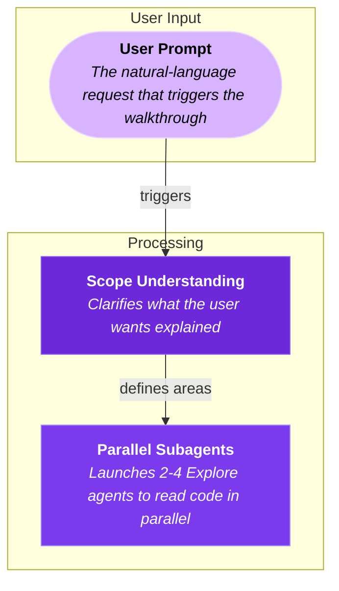

# Codebase Walkthrough Generator

Generate Markdown walkthrough files (`.md`) that give new developers a **quick mental model** of how a feature or system works. The goal is fast onboarding — a rough map of concepts and connections, not a code reference. Each walkthrough should be readable in under 2 minutes.

## Output Format

The output is a single `.md` file containing:

1. **Title and summary** — A heading and 2-3 sentence overview of what the walkthrough covers
2. **Mermaid diagram** — An embedded Mermaid diagram (in a fenced code block) showing the key concepts and how they connect
3. **Key Concepts table** — A reference table listing each node with its description and file path(s)
4. **How It Connects** — A brief prose section explaining the overall flow in plain English

The `.md` file renders natively on **GitHub**, in **VS Code**, and in any Markdown viewer that supports Mermaid fenced code blocks.

## Workflow

### Step 1: Understand the scope

Clarify what the user wants explained:
- A specific feature flow (e.g., "how does canvas drawing work")
- A data flow (e.g., "how does state flow from composable to component")
- An architectural overview (e.g., "how are features organized")
- A request lifecycle (e.g., "what happens when a user clicks draw")
- A database schema (e.g., "explain the tables and relationships")
- A data model (e.g., "how is user data structured")

Frame the walkthrough as a **mental model for someone new**. Think: "What are the 5-12 key concepts, and how do they connect?"

If the request is vague, ask one clarifying question. Otherwise proceed.

### Step 2: Explore the codebase with parallel subagents

**Always read real source files before generating.** Never fabricate code paths.

**Use the Task tool to delegate exploration to subagents.** This keeps the main context clean for diagram generation and parallelizes the research phase.

#### 2a. Identify areas to explore

Do a quick Glob/Grep yourself (1-2 calls max) to identify the relevant directories and file groups. Then split the exploration into 2-4 independent research tasks.

#### 2b. Launch parallel Explore subagents

Use `Task` with `subagent_type: "Explore"` to launch multiple agents **in a single message** (parallel). Each agent should investigate one area and report back the **purpose and connections** of each piece — not code dumps.

**Give each subagent a focused prompt that asks it to return a structured report with:**
- What the piece does (purpose) and why it exists (role in the system)
- How it connects to other pieces (imports, calls, data flow)
- A suggested node ID (camelCase) and plain-English label (e.g., "Drawing Interaction", not "useDrawingInteraction()")
- The primary file path(s)

**Tell each subagent to format its report as a list of nodes like this:**

```
NODE: drawingInteraction
  label: Drawing Interaction
  file: app/features/tools/useDrawingInteraction.ts
  purpose: Converts pointer events into shape data. This is the bridge between raw mouse input and the element model.
  connects_to: canvasRenderer (feeds shape data), toolState (reads active tool)
```

**Example: splitting a "drawing tool" walkthrough into subagents:**

```
Subagent 1: "Explore user input handling"
-> Read tool selection, pointer event handling
-> Report: purpose of each piece, how they connect

Subagent 2: "Explore rendering pipeline"
-> Read canvas rendering, scene management
-> Report: what renders elements, how it gets triggered

Subagent 3: "Explore element model and state"
-> Read element types, state management
-> Report: how elements are stored, what shape they have
```

**Do NOT read the files yourself** — let the subagents do it. Your job is to orchestrate and then synthesize their results into the diagram.

#### 2c. Synthesize subagent results (no more file reads)

Once all subagents return, you have everything needed. **Do NOT read any more files or launch more subagents.** Go directly to Steps 3-4.

Combine subagent findings into:
1. **Node list** — ID, plain-English label, primary file(s), 1-2 sentence description
2. **Edge list** — which nodes connect, with plain verb labels ("triggers", "feeds into", "produces")
3. **Subgraph groupings** — 2-4 groups with approachable labels ("User Input", "Processing", "Output")

**Keep to 5-12 nodes total.** Each node represents a *concept*, not a function. Group related functions into a single node. If you have more than 12 nodes, merge related ones.

If a subagent's report is missing info for a node, drop that node rather than reading files yourself.

### Step 3: Choose the diagram type

Pick the Mermaid diagram type based on the topic:

| Topic | Diagram Type | Mermaid Syntax |
|-------|-------------|----------------|
| Feature flows, request lifecycles, architecture | **Flowchart** | `graph TD` / `graph LR` |
| Database schemas, table relationships, data models | **ER Diagram** | `erDiagram` |
| Mixed (API flow + DB schema) | **Both** — render two diagrams in the same file | Flowchart + ER |

**Diagram sizing**: Keep to **5-12 nodes** grouped into **2-4 subgraphs**. This keeps the diagram scannable at a glance.

#### Flowchart (`graph TD` / `graph LR`)

**Direction**: Use `graph TD` (top-down) for hierarchical flows, `graph LR` (left-right) for sequential pipelines.

**Node labels**: Each node label includes a **title** and a **brief description** embedded directly in the node using line breaks. File paths go in the Key Concepts table in the markdown file, keeping the diagram clean.

**Node label format** (using HTML-style line breaks):
```
nodeId["<b>Title</b><br/><i>Brief description of what this does</i>"]
```

File paths are **not** included in node labels — they go in the Key Concepts table in the markdown file. This keeps the diagram clean and scannable.

**Node types** (styled by category):
| Type | Style | Use for |
|------|-------|---------|
| `component` | Purple-500 | Vue components, pages |
| `composable` | Purple-600 | Composables, hooks |
| `utility` | Purple-700 | Utils, helpers, pure functions |
| `external` | Gray-600 | Libraries, browser APIs, external services |
| `event` | Purple-200 | Events, user actions, triggers |
| `data` | Purple-600 | Stores, state, data structures |

**Subgraphs**: Group related nodes into 2-4 subgraphs with approachable mental-model labels (e.g., "User Input", "Core Logic", "Visual Output") — not technical layer names.

**Node IDs**: Use descriptive camelCase IDs (e.g., `drawingInteraction`, `canvasRenderer`).

**Edges**: Label with plain verbs — "triggers", "feeds into", "reads", "produces", "watches". Not API method names.

**Style definitions**: Always include `classDef` styles and `class` assignments for visual differentiation.

#### ER Diagram (`erDiagram`)

Use for database-related walkthroughs: schema design, table relationships, migrations, data models.

**Syntax**:
```
erDiagram
    USERS {
        string id PK
        string email UK
        string name
        timestamp created_at
    }
    TEAMS {
        string id PK
        string name
        string owner_id FK
    }
    TEAM_MEMBERS {
        string team_id FK
        string user_id FK
        string role
    }
    USERS ||--o{ TEAM_MEMBERS : "joins"
    TEAMS ||--o{ TEAM_MEMBERS : "has"
    USERS ||--o{ TEAMS : "owns"
```

**Relationship cardinality**:
| Syntax | Meaning |
|--------|---------|
| `\|\|--o{` | One to many |
| `\|\|--\|\|` | One to one |
| `}o--o{` | Many to many |
| `\|\|--o\|` | One to zero-or-one |

**Column markers**: `PK` (primary key), `FK` (foreign key), `UK` (unique).

### Step 4: Generate the Markdown file

Create a single `.md` file containing the diagram and supporting content.

**File location**: Write to the project root as `walkthrough-{topic}.md` (e.g., `walkthrough-canvas-drawing.md`). Use kebab-case for the topic slug.

**File structure**:

````markdown
# Walkthrough: Title of the Walkthrough

> 2-3 sentence TL;DR summary of what this walkthrough covers. Explains the scope and what a reader will understand after reading it.

## Diagram



## Key Concepts

| Concept | Description | File(s) |
|---------|-------------|---------|
| **User Prompt** | The natural-language request that triggers the walkthrough | `skills/walkthrough/skill.md` |
| **Scope Understanding** | Clarifies what the user wants explained | `skills/walkthrough/skill.md:14-26` |
| **Parallel Subagents** | Launches 2-4 Explore agents to read code in parallel | `skills/walkthrough/skill.md:28-84` |

## How It Connects

A brief prose description (3-5 sentences) of the overall flow in plain English, explaining how the key concepts work together. Write this for someone who has never seen the codebase — it should read like a short paragraph you'd tell a new teammate.
````

**Key rules for the .md file**:

1. **Title as H1** — Use `# Walkthrough: Topic` as the document title
2. **Blockquote summary** — A `>` blockquote with 2-3 sentence TL;DR immediately after the title
3. **Diagram section** — The Mermaid diagram goes in a fenced code block (` ```mermaid `) under an `## Diagram` heading
4. **Simplified node labels in diagram** — Nodes include `<b>Title</b>` and `<i>description</i>` but **NOT** file paths (those go in the table instead). This keeps the diagram clean and readable.
5. **Key Concepts table** — An `## Key Concepts` section with a Markdown table listing every node's concept name, description, and file path(s). Every row must correspond to a node in the diagram.
6. **How It Connects prose** — An `## How It Connects` section with 3-5 sentences explaining the overall flow in plain English
7. **Rich diagram labels** — Every node must include `<b>Title</b>` and `<i>description</i>` using HTML tags and `<br/>` line breaks
8. **Descriptions are 1-2 sentences** — Answer "what is this?" and "why does it exist?"
9. **File paths are real** — Every path in the Key Concepts table must point to an actual file in the codebase. Use `path:lines` format when relevant.
10. **Group edges after subgraphs** — Define all edges in a block after the subgraph definitions for readability
11. **Always include classDef and class** — Style definitions go at the end of the diagram
12. **Comment sections** — Use `%%` comments to separate logical sections within the diagram (subgroups, edges, styles)

## Mermaid Conventions

### Subgraph naming
Use approachable mental-model labels:
```
subgraph user_input["User Input"]
subgraph core_logic["Core Logic"]
subgraph visual_output["Visual Output"]
```

### Edge labels
Use plain verbs:
```
A -->|"triggers"| B
A -.->|"watches"| C
A ==>|"produces"| D
```

Use `-->` for direct calls, `-.->` for reactive/watch relationships, `==>` for events/emissions.

### Node shapes
Use different shapes to convey meaning:
```
nodeId["label"]          %% Rectangle — default
nodeId(["label"])        %% Stadium — entry/exit points
nodeId{"label"}          %% Diamond — decisions
nodeId[("label")]        %% Cylinder — databases/storage
```

## Quality Checklist

Before finishing, verify:

**Markdown structure:**
- [ ] File has an H1 title (`# Walkthrough: Topic`)
- [ ] Blockquote TL;DR summary is present after the title
- [ ] `## Diagram` section contains the Mermaid fenced code block
- [ ] `## Key Concepts` section has a table with Concept, Description, and File(s) columns
- [ ] `## How It Connects` section has 3-5 sentences of prose explanation
- [ ] Every row in the Key Concepts table corresponds to a node in the diagram

**Diagram quality:**
- [ ] Diagram has **5-12 nodes** (not more)
- [ ] Every node label includes a title and description (file paths are in the table, not the diagram)
- [ ] Node titles are plain English (no function signatures or file names as titles)
- [ ] No node description exceeds 2 sentences
- [ ] Every node maps to a real file in the codebase
- [ ] File paths in the Key Concepts table are correct and relative to project root
- [ ] The flowchart accurately represents the real code flow
- [ ] The diagram renders without Mermaid syntax errors
- [ ] Subgraph labels are approachable ("User Input") not technical ("Composable Layer")
- [ ] Edge labels are plain verbs ("triggers") not method names ("handlePointerDown()")
- [ ] classDef styles and class assignments are included
- [ ] The `.md` file is self-contained — no external dependencies
